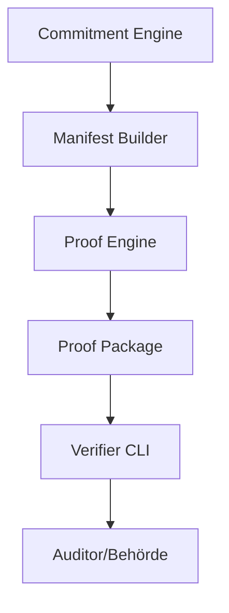

# 🧠 PRD – LkSG Proof Agent (Tag 3 – Proof & Verifier Layer)

## 1. Ziel & Umfang
Tag 3 erweitert den LkSG Proof Agent (Tag 2) um:
- **Proof-Engine (Mock → ZK-Ready Layer)**
- **Verifier-CLI (Open Source, offline)**
- **ZK-Proof-Schnittstellen (strukturierte Ein-/Ausgabe)**
- **Integrations-Format für Auditoren (Proof-Paket)**

Ziel:  
Ein vollständiges **Proof-Paket** erzeugen, das von Dritten (Auditor, Behörde, Investor) **offline** geprüft werden kann — ohne Einsicht in Rohdaten.

---

## 2. Lieferziel (Tag 3 = Proof Layer MVP)
1. CLI-Binary `cap-agent` mit neuen Subcommands:  
   - `proof build`  → erzeugt Proof-Paket  
   - `proof verify` → prüft Proof-Paket  
   - `verifier run` → separates Verifier-Tool  
2. Proof-Paket-Struktur (`build/proof_package/`):  
   - `manifest.json` (Tag 2-Output)  
   - `proof.dat` (Proof oder Mock-Beweis)  
   - `timestamp.tsa` (optional)  
   - `signature.json` (Unternehmenssignatur)
3. Alle Komponenten laufen **offline**, deterministisch und reproduzierbar.

---

## 3. Funktionale Anforderungen

### 3.1 Proof-Engine (Mock → ZK-Ready)
| Funktion | Beschreibung |
|-----------|---------------|
| `proof build` | Nimmt Manifest + Policy, erzeugt strukturierten Proof (Mock) |
| `proof verify` | Validiert Proof gegen Manifest und Policy-Hash |
| `proof export` | Packt Proof-Paket (manifest + proof + signature) |

**Proof-Objekt (Mock):**
```json
{
  "version": "proof.v0",
  "type": "mock",
  "statement": "policy:lksg.v1",
  "manifest_hash": "0x...",
  "policy_hash": "0x...",
  "proof_data": {
    "checked_constraints": [
      {"name": "require_at_least_one_ubo", "ok": true},
      {"name": "supplier_count_max", "ok": true}
    ]
  },
  "status": "ok"
}
```

Später (Tag 4) wird `proof_data` ersetzt durch echte ZK-Daten (z. B. Halo2, Spartan, Risc0, Nova).

---

### 3.2 Proof-Verifier (CLI oder Lib)
| Command | Beschreibung |
|----------|--------------|
| `verifier run --proof <file>` | Prüft Proof-Paket (manifest + proof + signature) |
| `verifier extract --manifest` | Extrahiert Policy- und Root-Hashes |
| `verifier audit --show` | Zeigt Audit-Tail und Event-Kette |

Der Verifier arbeitet ausschließlich **read-only**, benötigt:
- `manifest.json`  
- `proof.dat`  
- optional `signature.json`

---

### 3.3 Proof-Paket-Format
Verzeichnisstruktur:
```
build/proof_package/
├── manifest.json
├── proof.dat
├── signature.json
└── timestamp.tsa (optional)
```

`proof.dat` ist Base64-serialisiertes JSON (Proof oder Mock).  
`timestamp.tsa` (optional): RFC3161-Time-Stamp oder Blockchain-Anchor.

---

## 4. Datenflüsse



---

## 5. Audit-Log-Integration
Neue Events:
- `proof_built`
- `proof_verified`
- `proof_exported`
- `verifier_run`

Jeder Event folgt weiter der Hash-Chain-Logik (`sha3-256`).

---

## 6. Technische Vorgaben

| Bereich | Entscheidung |
|----------|---------------|
| Sprache | Rust (Edition 2021) |
| CLI | clap v4 (derive) |
| Hashing | blake3 + sha3-256 |
| Signatur | ed25519-dalek (Tag 2) |
| Proof-Formate | JSON / Base64 |
| Zeitformat | RFC3339 (UTC) |
| Plattform | Offline, Linux/macOS/Win |
| Netzwerk | **verboten** |
| Optional | Proof-Lib-Stub (z. B. `trait ProofSystem`) für spätere Integration |

---

## 7. Unit- und Integrationstests

| Bereich | Testfall | Erwartung |
|----------|-----------|-----------|
| Proof-Build | erzeugt deterministisches Proof-JSON | OK |
| Proof-Verify | bestätigt bei gültigem Manifest | OK |
| Proof-Verify | schlägt fehl bei verändertem Manifest | FAIL |
| Proof-Export | erzeugt vollständiges `proof_package/` | OK |
| Verifier-Run | erkennt konsistenten Proof | OK |
| Verifier-Run | erkennt manipulierten Proof | FAIL |
| Audit-Log | enthält alle Proof-Events | OK |

---

## 8. Akzeptanzkriterien
- `proof build` erzeugt `build/proof.dat`
- `proof verify` gibt OK bei gültigem Manifest
- `verifier run` bestätigt Proof-Paket offline
- Audit-Log verkettet alle Proof-Events
- Keine Compiler-Warnings (`cargo clippy -- -D warnings`)
- Tests bestehen
- Reproduzierbare Hashes & Proofs
- Dokumentation aktualisiert (`docs/system-architecture.md`, `docs/proof.schema.v0.md`)

---

## 9. Definition of Done (Tag 3)
- End-to-End-Pipeline:
  ```
  prepare → policy validate → manifest build → proof build → proof verify → sign manifest → verifier run
  ```
- Alle Artefakte in `build/proof_package/`
- Proof-Pakete verifizierbar durch externes Verifier-Tool
- CI-Pipeline grün (Build + Test + Clippy)
- Architekturdiagramm + Dokumentation aktualisiert

---

## 10. Claude-Hinweise (Code-Erstellung)

1. Lies dieses PRD vollständig.  
2. Baue auf bestehendem Projekt `cap-agent` (Tag 1 + 2).  
3. Füge neue Module hinzu:  
   - `proof_engine.rs`  
   - `verifier.rs`  
   - `traits.rs` (optional für ProofSystem Interface)  
4. Erweitere CLI-Kommandos: `proof build`, `proof verify`, `verifier run`.  
5. Implementiere `audit.append_event()` für neue Proof-Events.  
6. Keine Netzwerk- oder Cloud-Zugriffe.  
7. Liefere Unit- und Integrationstests nach Kriterien.  
8. Ergebnis muss direkt baubar sein:
   ```bash
   cargo build && cargo test
   ```
9. Nutze bestehende Module (`commitment`, `audit`, `manifest`, `sign`, `io`).
10. Output: lokale Dateien, reproduzierbare Proof-Paketstruktur.

---

## 11. Nächste Schritte (Tag 4 – ZK-Integration)
- Implementierung eines echten ProofSystems (Halo2, Spartan, Nova oder RISC0)
- Replacement von `proof_mock` durch `proof_engine`
- Integration öffentlicher Listen-Roots (Sanctions, Jurisdictions)
- ZK-Verifier CLI für Auditoren

---

© 2025 Confidential Assurance Protocol – Core Engineering  
Alle Rechte vorbehalten.
