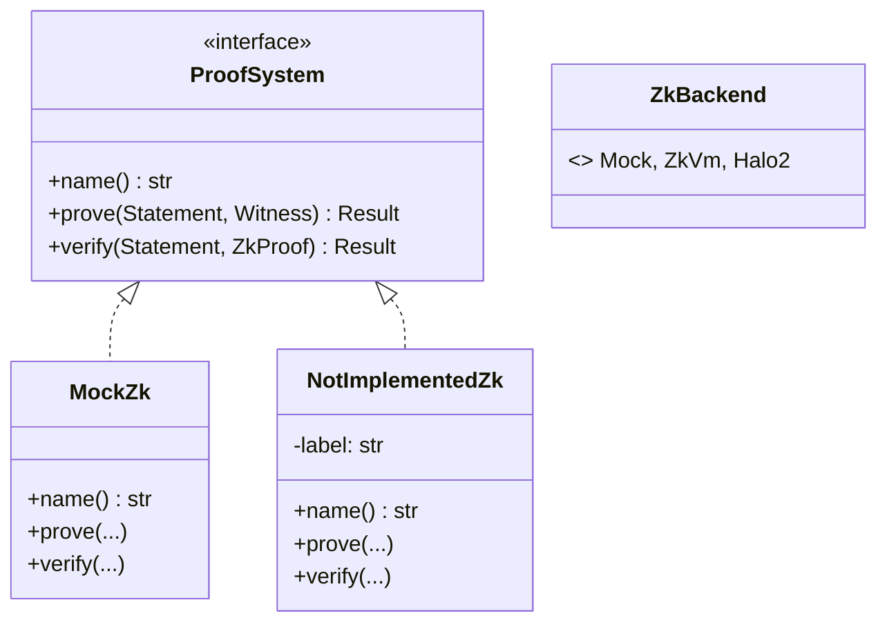

# 🔧 PRD / Design – ZK‑Backend‑Abstraktion (v0.6.1 → v0.7.0)

**Datum:** 2025‑10‑30  
**Status:** Umsetzbar (P0‑Scope)  
**Zielversion:** v0.6.1 (Refactor), v0.7.0 (erste echte Backends andocken)

---

## 🎯 Ziel
Eine saubere Abstraktionsschicht für Zero‑Knowledge‑Backends schaffen, ohne sofort ein echtes ZK (Halo2/RISC‑Zero) zu integrieren. Das bestehende Mock/Simplified‑ZK bleibt funktional, wird aber hinter ein Trait gelegt. CLI erhält schon heute `--backend`‑Flags.

**Erfolge nach Umsetzung:**
- Austauschbare ZK‑Backends über ein einheitliches Interface (`ProofSystem` Trait)
- CLI‑Stabilität: `proof zk-prove` / `proof zk-verify` mit `--backend mock` (Default)
- Keine Änderung an Manifest/Registry/Proof‑Paketformaten nötig

---

## 🧭 Scope (P0‑Refactor)
**In‑Scope**
- `zk_system.rs`: Einführung Trait `ProofSystem`
- `ZkBackend`‑Enum + Factory/Fn zur Auswahl des Backends
- Umverdrahtung CLI: neue Subcommands `zk-prove`/`zk-verify` (Alias zu `zk-build`/`zk-verify`)
- Serde‑kompatible Proof‑Container (keine Breaking Changes der Datei‑Formate)
- Basistests + Smoke‑Tests (CLI, Trait‑Dispatch)

**Out‑of‑Scope (später)**
- Halo2/RISC‑Zero‑Integration (nur Stubs/Feature‑Gates)
- Performance‑Optimierungen, Parallelisierung

---

## 🏗️ Architektur / Design

### 1) Trait und Backend‑Enum
```rust
// zk_system.rs
use anyhow::Result;

#[derive(Debug, Clone, Copy, PartialEq, Eq)]
pub enum ZkBackend {
    Mock,     // heutiges Simplified/Mock‑ZK
    ZkVm,     // Platzhalter (z. B. RISC Zero)
    Halo2,    // Platzhalter (z. B. halo2‑proof)
}

pub trait ProofSystem {
    fn name(&self) -> &'static str;
    fn prove(&self, stmt: &Statement, wit: &Witness) -> Result<ZkProof>;
    fn verify(&self, stmt: &Statement, proof: &ZkProof) -> Result<bool>;
}

pub fn backend_factory(kind: ZkBackend) -> Box<dyn ProofSystem> {
    match kind {
        ZkBackend::Mock => Box::new(MockZk::default()),
        ZkBackend::ZkVm => Box::new(NotImplementedZk::new("zkvm")),
        ZkBackend::Halo2 => Box::new(NotImplementedZk::new("halo2")),
    }
}
```

**Hinweis:** `Statement`/`Witness`/`ZkProof` bleiben binary‑kompatibel (serde), nur die Erzeugung/Verifikation geht über den Trait.

### 2) Mock‑Backend (heutige Logik kapseln)
```rust
#[derive(Default)]
pub struct MockZk;

impl ProofSystem for MockZk {
    fn name(&self) -> &'static str { "mock" }

    fn prove(&self, stmt: &Statement, wit: &Witness) -> Result<ZkProof> {
        // **Bestehende SimplifiedZK::prove() Logik hierher verschieben**
        simplified::prove(stmt, wit)
    }

    fn verify(&self, stmt: &Statement, proof: &ZkProof) -> Result<bool> {
        simplified::verify(stmt, proof)
    }
}

struct NotImplementedZk { label: &'static str }
impl NotImplementedZk { fn new(label: &'static str) -> Self { Self { label } } }
impl ProofSystem for NotImplementedZk {
    fn name(&self) -> &'static str { self.label }
    fn prove(&self, _s: &Statement, _w: &Witness) -> Result<ZkProof> {
        anyhow::bail!("backend '{}' not implemented", self.label)
    }
    fn verify(&self, _s: &Statement, _p: &ZkProof) -> Result<bool> {
        anyhow::bail!("backend '{}' not implemented", self.label)
    }
}
```

### 3) CLI‑Wiring
- Neue Subcommands: `proof zk-prove` / `proof zk-verify`
- Flags: `--backend <mock|zkvm|halo2>` (Default: `mock`)
- Abwärtskompatibel: `proof zk-build` bleibt als Alias zu `zk-prove`

```rust
// main.rs (CLI dispatch – stark vereinfacht)
#[derive(clap::ValueEnum, Clone, Copy)]
enum BackendArg { Mock, ZkVm, Halo2 }
impl From<BackendArg> for ZkBackend { /* mapping */ }

match cmd {
    Cmd::Proof(ProofCmd::ZkProve { backend, policy, manifest, out, sanctions_csv, .. }) => {
        let kind: ZkBackend = backend.unwrap_or(BackendArg::Mock).into();
        let ps = backend_factory(kind);
        let (stmt, wit) = load_statement_and_witness(policy, manifest, sanctions_csv)?;
        let proof = ps.prove(&stmt, &wit)?;
        save_proof(out, &proof)?;
        println!("✅ zk-prove ok via backend={}", ps.name());
    }
    Cmd::Proof(ProofCmd::ZkVerify { backend, proof, policy, manifest }) => {
        let kind: ZkBackend = backend.unwrap_or(BackendArg::Mock).into();
        let ps = backend_factory(kind);
        let (stmt, _) = load_statement_only(policy, manifest)?;
        let p = load_proof(proof)?;
        let ok = ps.verify(&stmt, &p)?;
        println!("{}", if ok { "✅ valid" } else { "❌ invalid" });
    }
    // Alias: zk-build → zk-prove
    Cmd::Proof(ProofCmd::ZkBuild { .. }) => { /* call ZkProve path */ }
}
```

### 4) Datenformate & Kompatibilität
- **Unverändert:** `zk_proof.dat/json`, `manifest.json`, `registry.json`
- **Proof‑Header** (optional) kann backend‑Metadaten tragen:
```json
{
  "proof_type": "zk",
  "backend": "mock",   
  "version": "0.1"
}
```
- Registry‑Hashes bleiben stabil (Datei‑Hashing unverändert)

### 5) Feature‑Gates (Vorbereitung)
- Cargo‑Features: `zk-mock` (default), `zk-zkvm`, `zk-halo2`
- `backend_factory` kann Build‑Zeit‑Guards nutzen (`cfg(feature = ...)`) und ansonsten auf `NotImplementedZk` fallen.

---

## 📦 CLI‑Spezifikation

```
cap-agent proof zk-prove \
  --policy <policy.yml> \
  --manifest <manifest.json> \
  [--sanctions-csv <csv>] \
  [--backend mock|zkvm|halo2] \
  [--out build/zk_proof.dat]

cap-agent proof zk-verify \
  --proof <zk_proof.dat> \
  --policy <policy.yml> \
  --manifest <manifest.json> \
  [--backend mock|zkvm|halo2]
```

**Defaults:** `--backend mock`, Output wie bisher (`build/zk_proof.dat`).

---

## ✅ Akzeptanzkriterien
1. **Build & Tests grün** mit `zk-mock` (default)
2. `cap-agent proof zk-prove --backend mock` erzeugt identische Proofs wie `zk-build`
3. `cap-agent proof zk-verify --backend mock` verifiziert bestehende Proofs
4. Unbekannter Backend‑Wert → klare Fehlermeldung
5. Alias `zk-build` ruft intern `zk-prove` auf (Deprecation‑Hinweis)
6. README/Doku aktualisiert (CLI‑Beispiele, Backend‑Hinweis)

---

## 🧪 Testplan
- **Unit:**
  - `mock_backend_roundtrip_ok()` – prove→verify = true
  - `backend_factory_resolves_mock()`
  - `backend_not_implemented_errors()` für `zkvm`/`halo2`
- **CLI Smoke:**
  - `proof zk-prove --backend mock ...` → Datei existiert, Hash ändert sich nicht
  - `proof zk-verify --backend mock ...` → Exit‑Code 0
  - `proof zk-prove --backend halo2` → Exit‑Code ≠ 0, verständliche Fehlermeldung
- **Regression:** Alte `zk_build` Artefakte verifizierbar

---

## 🔁 Migrationsschritte (Dev)
1. `zk_system.rs`: Trait + Enum + MockZk extrahieren
2. Alte `SimplifiedZK`‑Funktionen in `simplified` Modul verschieben
3. CLI Subcommands ergänzen; Alias `zk-build` beibehalten
4. README + Systemarchitektur aktualisieren (Command Tree)
5. Tests anpassen/hinzufügen

---

## 🧩 Anschlussfähig für echte Backends
- **ZK‑VM (RISC‑Zero):** eigenes Modul `zkvm_backend.rs`, Implementierung `ProofSystem`
- **Halo2:** `halo2_backend.rs` mit Constraint‑Synthese; Statement→Circuit Mapping
- Common: `Statement/Witness`→Backend‑spezifische Repräsentation in Adapterfunktionen

---

## ⚠️ Risiken & Gegenmaßnahmen
- **API‑Drift** zwischen Backends → striktes Trait‑Contract, Golden‑Files für Proof‑Header
- **CLI‑Verwirrung** durch neue Subcommands → Alias + klare Hilfe‑Texte
- **Künftige Breaking Changes** (Circuit‑Formate) → Versionsfeld im Proof‑Header

---

## 🗺️ Rollout
- v0.6.1: Refactor + CLI‑Flags + Tests
- v0.7.0: Erster „echter“ Backend‑Spike hinter Feature‑Flag, keine Default‑Änderung

---

## 📚 Doku‑Updates
- **README.md**: neue Beispiele mit `--backend`, Hinweis auf Abstraktion
- **SYSTEMARCHITEKTUR_v0.6.0.md**: CLI‑Baum ergänzen (zk-prove/zk-verify), Layer 4 um Trait‑Diagramm erweitern
- **MD/PRD_P3_ZkBackend_Abstraction.md**: dieses Dokument

---

## 📐 Mermaid – Mini Klassendiagramm

---

## 📝 Changelog (geplant)
- **Added:** Trait `ProofSystem`, Enum `ZkBackend`, CLI `zk-prove`/`zk-verify`
- **Changed:** `zk-build` → Alias (Deprecation‑Hinweis)
- **Docs:** README & Systemarchitektur aktualisiert
- **Tests:** Neue Unit‑ und CLI‑Smoke‑Tests
